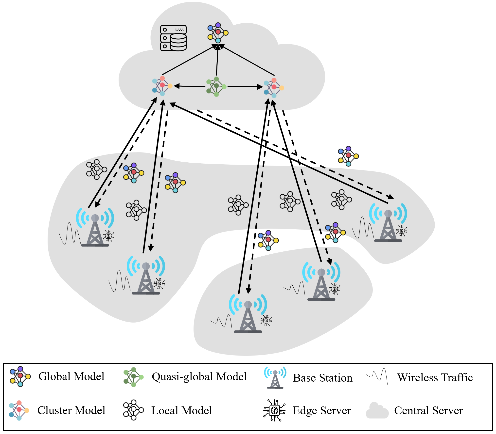
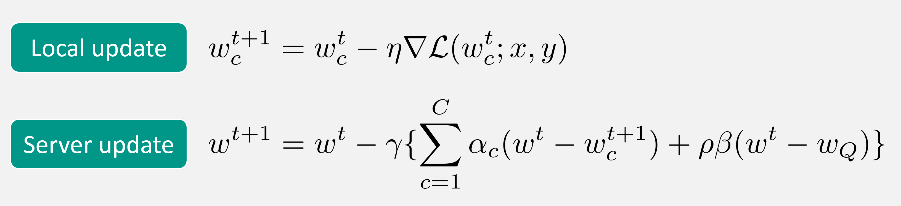

## Introduction

This is the source code for our paper entitled 'Dual Attention-Based Federated Learning for Wireless Traffic Prediction'.

## Datasets

First one [Milano](https://drive.google.com/file/d/1aKh1icdmK9ho3mOZiNg593ivgIeycWKz/view?usp=sharing) and second one [Trentino](https://drive.google.com/file/d/1R-hrUVS1TY6Eec6k6aN_ce4u56LeYNHv/view?usp=sharing)

## Runnable scripts

You can also find an runnable code of our paper at [Codeocean](https://codeocean.com/capsule/4767521/tree)

## Abstract

Wireless traffic prediction is essential for cellular networks to realize intelligent network operations, such as loadaware
resource management and predictive control. Existing prediction approaches usually adopt centralized training architectures
and require the transferring of huge amounts of traffic data, which may raise delay and privacy concerns for certain
scenarios. In this work, we propose a novel wireless traffic prediction framework named Dual Attention-Based Federated
Learning (FedDA), by which a high-quality prediction model is trained collaboratively by multiple edge clients. To simultaneously
capture the various wireless traffic patterns and keep raw data locally, FedDA first groups the clients into different clusters
by using a small augmentation dataset. Then, a quasi-global model is trained and shared among clients as prior knowledge,
aiming to solve the statistical heterogeneity challenge confronted with federated learning. To construct the global model, a dual
attention scheme is further proposed by aggregating the intra and inter-cluster models, instead of simply averaging the weights
of local models. We conduct extensive experiments on two real-world wireless traffic datasets and results show that FedDA
outperforms state-of-the-art methods. The average mean squared error performance gains on the two datasets are up to 10% and
30%, respectively.

## System Model

## Update Rules

## Paper
If you find the code useful, please cite our paper in your work as follows:

C. Zhang, S. Dang, B. Shihada and M. -S. Alouini, "Dual Attention-Based Federated Learning for Wireless Traffic Prediction," IEEE INFOCOM 2021 - IEEE Conference on Computer Communications, 2021, pp. 1-10.